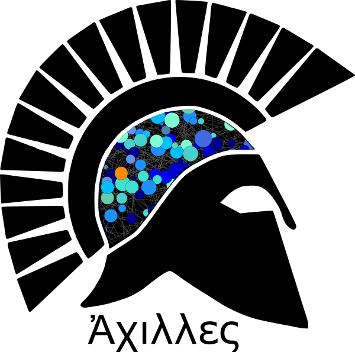

  </img>

# Achilles

Achilles is a neural network model that distinguishes between nanopore signals from hosts (e.g. human background) and pathogens (e.g. *B. pseudomallei*). The model trains currently on a small number of reads reads (~ 3000 reads). Issues are tracked on Github. Next steps are to reduce overfitting and deepening the network for generalisation over the human genome and diverse bacterial or viral pathogens. Patient sample simulations (i.e. pathogen DNA in contaminant human DNA) and real-time sequencing runs of MRSA genomes are planned for release. We will extend the architecture to multi-label classifications (i.e. human, bacterial, viral) for rapid pathogen identification from complex mixtures in the future.

This is a sort of minimal Keras implementation / adaptation of the open-source [deep neural net base-caller Chiron](https://github.com/haotianteng/Chiron), and all credit for the architecture of the model is due to Haotian Teng and Lachlan Coin, and the co-authors of [Chiron published in Gigascience (2018)](https://academic.oup.com/gigascience/article/7/5/giy037/4966989). It differs in several components, like current minimal model depth (1 residual block, one bidirectional LSTM) or using recurrent dropout instead of recurrent batch normalization, which was not readily available in Keras. It also gets rid of the CTC decoder and outputs with a simple fully-connected (binary) layer and Softmax activation in the current model configuration.

### Performance for classification of human (chromosome 20) and *B. pseudomallei*
---

This is a proof-of-concept for a pathogen detector based on raw nanopore signal from the [environmental bacterium and biothreat agent *B. pseudomallei*](https://www.ncbi.nlm.nih.gov/pmc/articles/PMC4746747/) in host contaminant background of human DNA on MinION 1D R9.4. This architecture can be modified for different pathogen detection scenarios i.e. different host backgrounds or more complex microbial communities. By extending the open-source architecture based on Chiron, the detector can be trained *de novo* and on data suitable to specific local problems. This section on performance also looks at evaluating generalization of learning from a tiny fraction of chromosome 20 to accurately classify human signal from other chromosomes. In the evaluaton data, we also swap pathogen signals to assess generalization to other bacterial or viral pathogens and threshold the taxonomic distances, at which classification breaks down. This is all kinds of cool, because we are in the broadest sense trying to teach an AI what a human genome in signal space looks like.

#### Architectures
---

| Run ID    | ResBlocks | BLSTMs  | Windows   | Total     | Batch Size  | Epochs | LSTM Dropout   |  Parameters | Dataset |
| :-------: | :-------: | :-----: | :-------: | :-------: | :---------: | :----: | :------------: |  :--------: | :-----: |
| minimal_1 |  1        | 1       | 400 x 400 | 300000    | 800         | 38/40  | 0.2            |  999,778    | Chr20   |
| minimal_2 |  1        | 1       | 400 x 400 | 300000    | 800         | 38/40  | 0.2            |  999,778    | Chr14   |

#### Evaluations (Accuracy)
---

| Run ID     | Training | Validation | Chr20    | Chr14   | Chr11   | Mixed  |
| :--------: | :-------:| :--------: | :------: | :-----: | :-----: | :----: |
| minimal_1  |  90.78%  | 90.59%     | 89.37%   | 87.04%  | 86.50%  | 87.97% |
| minimal_2  |  91.78%  | 91.26%     | 85.42%   | 88.30%  | 84.03%  | 86.27% |

#### Training, validation and evaluation data sets
---

**Training data set for detection of *B. pseudomallei* in [human background](https://github.com/nanopore-wgs-consortium/NA12878/blob/master/Genome.md) DNA from the `nanopore-wgs-consortium/NA12878` genome project**:

* 150,000 (Burkholderia), 150,000 ([terminal chromosome 20](http://s3.amazonaws.com/nanopore-human-wgs/rel3-fast5-chr20.part05.tar), [central chromosome 14](http://s3.amazonaws.com/nanopore-human-wgs/rel3-fast5-chr14.part04.tar))
* 2762 Fast5
* 70% training, 30% validation
* 400 x 400, not normalized, random select + random consecutive scan

**Evaluation data sets for generalizing over human genome**:

* 150,000 (Burkholderia), 150,000 (Human)
* 400 x 400, not normalized, random consecutive scan

* random selection (same as training) of terminal [chromosome 20 (part5)](http://s3.amazonaws.com/nanopore-human-wgs/rel3-fast5-chr20.part05.tar) Fast5
* random selection of terminal [chromosome 11 (part9)](http://s3.amazonaws.com/nanopore-human-wgs/rel3-fast5-chr11.part09.tar) Fast5
* random selection  (same as training) of central [chromosome 14 (part4)](http://s3.amazonaws.com/nanopore-human-wgs/rel3-fast5-chr14.part04.tar) Fast5
* mixed random selection of chromosomes (11, 14, 20)

**Example command line task to generate training and evaluation data**:

`achilles make --dirs bp,human_chr14 --data_file training.chr14.h5 -l 400 -s 400 -m 150000`

### Documentation
---

[asclepius.readthedocs.io](https://asclepius.readthedocs.io)
