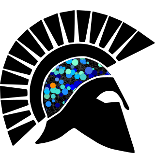
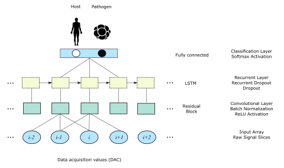

<p align="left"></img></p>

# Achilles


 **`v0.3-alpha`**: `internal release, no tests`

`Achilles` is a platform for training, evaluating and deploying neural network models that act as taxonomic classifiers of raw nanopore signal, for instance by distinguishing between nanopore signals from hosts (e.g. human background) and pathogens (e.g. *Burkholderia pseudomallei* or *Mycobacterium tuberculosis*). The minimal hybrid architecture of the networks can also be thought of as a template for a variety of classifiers, that can be trained on any property of the sequence data that is discernible from the pore signal and can be labelled across signal reads.

The neural networks are essentially a Keras implementation of the hybrid convolutional and recurrent architecture from [deep neural net base-caller Chiron](https://github.com/haotianteng/Chiron) [published in Gigascience (2018)](https://academic.oup.com/gigascience/article/7/5/giy037/4966989). We have replaced some of the regularization functions with those available in `Keras`, in particular we implemented internal and regular Dropout in the LSTM layer instead of Batch Normalization.

<p align="center"></img></p>

Overall, the implementation is minimal, and replaces the bi-directional LSTM with a regular LSTM layer, as well as combining only a single resiudal block with a single LSTM, totalling around 600,000 learnable parameters, somewhere around the size of MobileNets. This necessitates a higher number of epochs for training, but stil learns from limited signal data and keeps model prediction fast in the interest of mobile deployment or real-time / online learning from sequence stream

### :snake: Install
---

Achilles can be installed with:

```
pip install -e git://github.com/esteinig/achilles.git@v0.3-alpha  # does not install tensorflow-gpu
```

You know if the driver and `tensorflow-gpu` work when you call the main help interface of `Achilles`:

```
achilles --help
```

`Tensorflow-GPU` and the associated `CUDA` driver on the GPU must be installed. We used `Achilles` on the JCU cluster that has two Tesla V100 with 16GB memory. For some reason, installation of the GPU environment did not work with higher `tensorflow-gpu` versions `> v1.8` that interface with `CUDA 9.2` or `CUDA 10`, so we installed `tensorflow-gpu v1.8.0` from `conda` with the `cudnn` library version `v7.1.2`, which also installs the `cudatoolkit` version `v9.0` in `conda`. This environment works with the `CUDA 9.0` driver for the GPUs on the cluster. 

The frozen `conda` env for this can be found in `envs/achilles-jcu.yml` and installed with:

```
conda env create --file envs/achilles-jcu.yml
```

### :whale: Command line interface
---

Alpha version is for testing the software with some pre-trained models. You can also train your own models, which relies on `Poremongo` also in alpha stage at the moment and subject to change, so the code is not so stable. 

Achilles is accessible through the CLI which summarizes some of the important tasks and exposes them to the user. Tasks like `achilles train` and `achilles create` have many parameters for setting the global parameters for signal sampling or the framework in which the models are trained. 

This is somewhat what the process currently looks like minus Nextflow + Docker + Google Cloud which is scheduled for the beta release.

<p align="left"></img></p>

#### Tasks
---

:sunflower: **`achilles create`**

Create a training or evaluation `HDF5` data set of singal slices from the `Fast5` files for input into training with `Achilles`. Uses `Poremongo` to sample labels from `MongoDB` database index of all read files on the system. Does not need GPU.

```
Usage: achilles create [OPTIONS]

  Sample and compile datasets with PoreMongo

Options:
  -i, --pmid                      PoreMongo connection ID.
  -c, --config                    YAML configuration file for creating
                                  Datasets.
  -t, --tags                      Tags (labels) to sample from, comma
                                  separated args.
  -o, --output, --dataset         Output HDF5 file containing sampled tensors
                                  and labels.  [default: dataset.hd5]
  -m, --max_windows               Maximum number of sampled signal value
                                  windows per tag / label.  [default: 100000]
  -r, --max_windows_per_read      Maximum number of windows sampled from read
                                  / diversity of input data.  [default: 50]
  -w, --window_size               Length of sliding window to sample from
                                  signal read.  [default: 200]
  -s, --window_step               Step of sliding window to sample from signal
                                  read.  [default: 0.1]
  -rs, --sample                   Number of random Fast5 models to sample from
                                  database per tag / label  [default: 10000]
  --proportion                    Proportion of Fast5 models to sample per tag
                                  / label  [default: equal]
  --exclude                       Comma separated list of HDF5 datasets to
                                  exclude from sampling
  --global_tags                   Global tags to apply to sample, comma-
                                  separated, e.g. to force pore version: R9.4
                                  [default: R9.4]
  --validation                    Proportion of data to be split into
                                  validation
  --display                       Display tags in database and exit.
                                  [default: False]
  --help                          Show this message and exit.

```

***

:seedling: **`achilles train`**

Train a `HDF5` training dataset of signal slices and labels in `Keras` using the `Achilles` variant of `Chirons` hybrid convolutional and recurrent architecture. A simple fully connected layer predicts labels in the output. Absolutely needs GPU for training.

```
Usage: achilles train [OPTIONS]

  Train neural network classifiers in Achilles

Options:
  -f, --file                Input training / validation HDF5 dataset
                            [required]
  -i, --run_id              Training run ID  [default: model; required]
  -o, --outdir              Output directory  [default: training_model;
                            required]
  -l, --load                Trained model weights from Keras, HDF5 to continue
                            training, or re-train model  [default: ]
  -v, --verbose             Show training progress output and model
                            architecture in Keras  [default: False]
  -a, --activation          Activation function applied to final fully
                            connected classification layer  [default: softmax]
  --residual_block          Number of stacked ResidualBlocks in initial layers
                            [default: 1]
  --lstm                    Number of stacked LSTMs connected to Residual
                            Blocks  [default: 1]
  --channels                Number channels per Residual Block  [default: 256]
  --units                   Number of units per LSTMs  [default: 200]
  --gru                     Simple GRU cell instead of LSTM  [default: False]
  --bidirectional           Bidirectional LSTM  [default: False]
  --dropout                 Dropout applied to LSTM layers  [default: 0.2]
  --recurrent_dropout       Internal dropout applied to LSTM layers  [default:
                            0.2]
  --optimizer               Compile model with optimizer for training
                            [default: adam]
  --loss_function, --loss   Compile model with loss function for training
                            [default: binary_crossentropy]
  -e, --epochs              Number of epochs to train model for  [default:
                            100]
  -b, --batch_size          Batch size for training, major determinant of RAM
                            used on GPU  [default: 200]
  -t, --threads             Feed batches into training function using multiple
                            processes  [default: 2]
  --gpus                    Build the model for distributed training across
                            multiple GPUs  [default: 1]
  -g, --gpu                 SET CUDA_VISIBLE_DEVICES to train model on
                            specific GPU (e.g. 0 or 0,1)
  --help                    Show this message and exit.
```

***

:deciduous_tree: **`achilles predict`**

Predict labels using a trained model and a directory of `.fast5` files. Can `--watch` a dirrectory for live `.fast5` files. Should run on GPU.

```
Usage: achilles predict [OPTIONS]

  Make predictions on a directory of Fast5

Options:
  -d, --dir                  Directory for incoming Fast5 to classify
  -w, --watch                Watch directory for incoming Fast5 to classify
  -m, --model                HDF5 file of trained Achilles model
  -s, --window_size          Length fo window, must match trained input model
                             [default: 100]
  -sc, --window_slices       Maximum number of window slices sampled from read
                             [default: 50]
  -ws, --window_step         Step of sliding window to sample from signal
                             read.  [default: 0.1]
  -b, --batch_size           Batch size for prediction, determinant of
                             RAM used on GPU  [default: 200]
  -g, --gpu                  Set CUDA_VISIBLE_DEVICES to train model on
                             specific GPU (e.g. 0 or 0,1)
  -ms, --model_summary       Show model layer summary on loading model
                             [default: False]
  -n, --product              Calculate the normalized product for predicting 
                             labels over slices [default: False]
  --help                     Show this message and exit

```

***

:cactus: **`achilles eval`**

Evaluate a trained `HDF5` model (always best validation error from training run with `achilles train`) across a directory of evaluation datasets. Should run on GPU.

```
Usage: achilles evaluate [OPTIONS]

Options:
  -m, --model        Model file HD5.
  -e, --evaluation   Evaluation file HD5 sampled from Achilles.
  -b, --batch_size   Evaluation batch size.  [default: 500]
  --help             Show this message and exit.
```


### :cat2: Pre-trained models (v.0.3-alpha)
---

Currently all pretrained models are standardized to a lightweight `1 x 256-channel ResBlock + 1 x 200-unit LSTM` architecture with `Dropout` in recurrent layers that predicts on overlapping slices of 400 signal values from `R9.4` pores; this creates a network model with around 631,730 parameters, which we trained in 500 epochs on a Tesla V100 GPU with 16GB memory over 8 hours with a batch size of 3000 batches per forward pass. The model predicts from a fully connected layer with `Softmax` activation function over `n` labels. Training on the alpha version models is conducted on 100,000 signal slices extracted evenly over each subcategory of the label (pathogens, chromosomes) with a random sampling window on the read that extracts `50 x 400` slices with step 40. This equates to roughly 2000 reads per label and around 200 - 1000 reads per subcategory in the label depending on the number of subcategory mixtures that tags in the database are sampled from (e.g. pathogens or chromosome mixtures). Models are trained using `Adam` optimizer and the `binary crossentropy` loss function, which is selected due to the binary prediction of `pathogen` vs. `host`, depending on how we train the models with pathogen subcategories and human chromsomes.


```yaml
create:
  global_tags: R9.4
  sample_proportions: equal
  sample_files_per_tag: 20000
  max_windows: 100000
  max_reads: null
  window_size: 300
  window_step: 0.1
  window_random: true
  window_recover: true
  max_windows_per_read: 50

train:
  window_size: 300
  workers: 2
  nb_residual_block: 1
  nb_rnn: 1
  activation: softmax
  optimizer: adam
  loss: binary_crossentropy
  epochs: 300
  batch_size: 300
  dropout: 0.2
  recurrent_dropout: 0.2
```

In these pretrained models the human label is always trained from chromosomes 2, 4, 8, 16 and evaluated on chromsomes 5, 9, 15, 17 to make sure that the classifiers generalize over the whole human genome. Mixtures of pathogens on the other hand are useful to build generalized classifiers (bacteria vs. human) vs. specific classifiers (MRSA vs human). Label 0 in these models is pathogen, and label 1 is the host.

```yaml
training:
  - id: tb
    tags: [[TB], [Chr_2, Chr_8, Chr_14, Chr_18]]
  - id: bp
    tags: [[BP], [Chr_2, Chr_8, Chr_14, Chr_18]]
  - id: kleb
    tags: [[Kleb], [Chr_2, Chr_8, Chr_14, Chr_18]]
  - id: ecoli
    tags: [ Ecoli], [Chr_2, Chr_8, Chr_14, Chr_18]]
  - id: lambda
    tags: [[Lambda], [Chr_2, Chr_8, Chr_14, Chr_18]]
  - id: mock
    tags: [[Mock], [Chr_2, Chr_8, Chr_14, Chr_18]]
  - id: bacteria1
    tags: [[BP, Kleb, Ecoli], [Chr_2, Chr_8, Chr_14, Chr_18]]
  - id: bacteria2
    tags: [[TB, Kleb, Ecoli], [Chr_2, Chr_8, Chr_14, Chr_18]]
```

***

:mouse2: **Generalists**:

  * Bacteria in human host (trained on Human reference genome mixture of chromosomes and *K. pneumoniae*, *M. tuberculosis*, *B.  pseudomallei*)  - `models/alpha/bacteria1.human.hd5`
  * Bacteria in human host (trained on Human reference genome mixture of chromosomes and *E. coli*, *M. tuberculosis*, *B.  pseudomallei*)  - `models/alpha/bacteria2.human.hd5`
  
:penguin: **Specialists**:

* *Mycobacterium tuberculosis* in human host  - `models/alpha/mtuberculosis.human.hd5`
* *Klebsiella pneumoniae* in human host - `models/alpha/kpneumoniae.human.hd5`
* *Burkholderia pseudomallei* in human host - `models/alpha/bpseudomallei.human.hd5`
* Lambda phage in human host - `models/alpha/lambda.human.hd5`
* Mock community bacteria in human host - `models/alpha/bacteria2.human.bacteria.hd5`
 
:octopus: **Multitaskers**:

 * ... soon ...

### :turtle: Training data
---

**Pathogens**:

* Zika virus detection from [ZIBRA](http://www.zibraproject.org/data/) project in Brazil - 2D R9 amplicons
* *Burkholderia pseudomallei* + closely related *B. cepacia*, *B. mallei* - 1D Rapid R9.4
* XDR *Mycobacterium tuberculosis* from Papua New Guines - 1D Rapid R9.4
* *Klebsiella penumoniae* from clinical culture in Australia - 1D Rapid R9.4
* *Staphylococcus aureus* from reference strain ST243 - 1D Rapid R9.4

**Hosts**:

* [Human nanopore reference genome](https://github.com/nanopore-wgs-consortium/NA12878/blob/master/Genome.md) CEPH1463 (NA12878/GM12878, Ceph/Utah pedigree) - 1d Rapid R9 + R9.4

### :fish: Documentation
---

[achilles.readthedocs.io](https://achilles.readthedocs.io)
